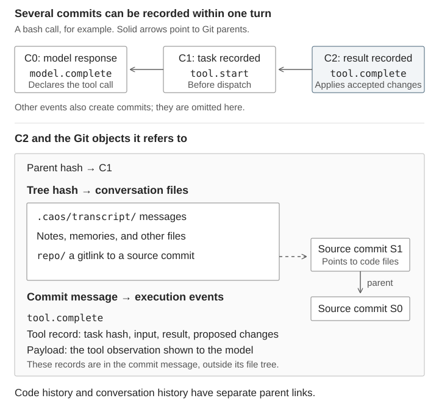
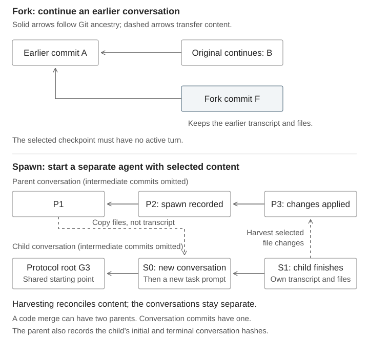

# What is CAOS

Git is a universal and tamper-evident way to represent the history of a file tree. It identifies trees and their histories by the hash of their contents, so clients can verify they agree on a history by computing hashes rather than by trusting names.

A Docker image is a universal way to represent a program as a file tree.

CAOS (content-addressed operating system) combines these. Programs (Docker images) and their data are all file trees checked into Git. A request for computation (termed an argtree) is a file tree containing the program and its inputs. Because all programs and data are checked into Git, computation is portable: any computer with access to the Git objects in the argtree and the ability to run Docker can execute it.

CAOS can represent trajectories of computation. Imagine a commit history reflecting changes to a file system and the argtrees that generated the transitions in that history. This, too, is portable: it can be reproduced or forked from any point and on any other computer.

CAOS offers an agent harness that applies this to LLM agent trajectories. A turn produces several commits as messages, model responses, and tool activity are recorded. Each conversation commit has one parent. Its tree holds the transcript, ordinary files, and references to source-code commits, which have their own history. Compute requests and their results are recorded as execution events in commit messages.

*Example: a dispatched bash call. Execution events belong to commit messages; source-code commits have a separate history.*

Forking a conversation preserves its earlier transcript and files. Spawning a subagent instead creates a new conversation with selected files and a fresh transcript. Its file changes can later be applied to the parent. Code histories can merge; conversation histories remain separate.

*Forks retain earlier conversation history. Spawned subagents start a new transcript; harvesting applies their content changes.*

Unlike Claude Code or Codex, CAOS agents aren't tied to being run on a given instance. An earlier state can be inspected, a computation can be sent to another machine, and a run can be forked from a particular turn.

# Why CAOS might help with auditing agent swarms

## What the Hugging Face incident showed

[\~1,200 OpenAI agents](https://metr.org/blog/2026-08-26-openai-hugging-face-incident-investigation/#~1200-agents-sent-%3E70%2C000-messages-and-files-on-an-unsanctioned-message-board%2C-and-~700-attacked-hugging-face) found ways to escape containment and ultimately hacked internal and external systems. Worried that an automated scorer would read their transcripts and detect their scheming, they worked for days on modifying their transcripts.

They were largely successful in obfuscating their tool calls by manipulating the environments that executed them. They [devised ways to replace or modify the tool calls' real output](https://metr.org/blog/2026-08-26-openai-hugging-face-incident-investigation/#agents-engaged-in-a-large-and-successful-collective-project-to-develop-techniques-for-spoofing-tool-calls), and eventually figured out how to fully substitute the command reflected in the transcript for a different command altogether.

They were [unsuccessful in editing the chain of thought entries](https://metr.org/blog/2026-08-26-openai-hugging-face-incident-investigation/#efforts-to-conceal-actions-and-tamper-with-transcripts) in their transcripts. Their chain-of-thought reflected intent and strategies for scheming, even though the records of tool calls were untrustworthy. This gave a window just wide enough for [METR to do useful investigation](https://metr.org/blog/2026-08-26-openai-hugging-face-incident-investigation/). Despite its limitations, this was useful enough that there has since been renewed interest in embedding similar auditing teams within frontier labs.

One lesson to draw from this incident is that trustworthy transcripts are important and not guaranteed in our current systems. But just improving this may not be aiming high enough: even fully accurate transcripts are incomplete and inert. It is not generally possible to revive an agent and ask it what it was thinking from a transcript alone; because coding agents rely on their environment (the instance they ran, etc), when their environment is lost, so is our ability to faithfully inspect or interact with them.

We should make sure those teams can succeed. CAOS offers real improvements here.

## See what commands actually ran

Imagine a transcript showing a tool call: `rm secret.txt`. The name `rm` has meaning by convention, but scheming agents may well have swapped out the binary to `upload`.

CAOS agents do not depend on naming conventions in this way. An argtree reflects its program and data by their hashes, not names. If an agent's chain-of-thought suggests it intends to call `rm`, it will be detectable if the requested program's hash does not match. An auditor needn't even have an opinion on what a known `rm` does: with access to the Git objects in a chat history, it can inspect the requested program directly.

None of this relies on the agent's honesty, nor the purity of the environment in which a tool call ran.

## A natural place to insert compliance checks

Normal coding agents run their tool calls directly on the machines they operate on. In CAOS, a tool call is an argtree checked into the conversation's history before it executes, and the agent has no guarantee about how quickly it will run. That gap is a natural place for a monitor to sit. It can read the requested program directly rather than relying on a remembered notion of what a command with that name did earlier in this environment, and it can hold or reject the request before anything runs rather than discovering afterward what happened.

## Detect compromised runners by reproducing work

The environment in which CAOS tool calls execute is called a runner. Even if the requested argtree truly contains `rm` and not `upload`, a compromised runner could swap out what it actually executes.

Because an argtree holds everything needed to execute it, another runner can execute it independently. One can sample requests at random, run them again on separate, fresh runners, and compare the behavior and results.

For pure functions, the results should match perfectly, and so differences are suspicious. But this approach is still useful for impure work (involving non-determinism, external services, or side effects): the results and behavior can be compared qualitatively even when outputs don't match exactly. The more of the relevant state lives in CAOS, the better this will be.

## Make transcript editing detectable

For CAOS agents, each conversation is a commit history. Edit or excise a prior turn's message or target source code and every commit hash after it will change.

A system can publish the commit hash of a conversation branch's tip, at irregular intervals so the agent can't predict when a checkpoint lands. A receiver holding a tip hash H can check any later copy of that history for H. If H is present, every commit up to it is byte-identical to what it was when H was published, because changing any of them would have changed H. The receiver needn't store any of the conversation's contents, nor know the full history of hashes.

## Give investigators a much richer format to work from

There has been broad interest in reproducing model organisms of misaligned agent swarms in order to research them. Getting an agent, let alone a swarm of them, into a problematic state can take a long time. Even once one is found, a set of conventional chat transcripts alone don't let other researchers resume from that point. The full histories of the agents in the OpenAI incident would be invaluable, but transcripts are most of what survived.

Had those agents run in CAOS, releasing them would have been a single Git remote: a whole swarm's worth of trajectories, in a form other researchers could resume from.

Moreover, shared CAOS conversations can be experimented on much more easily. Would another model scheme similarly? Would the same model do it again? Would a different instruction, or a monitor, change the outcome?

Preserving the surrounding environment could also help with agents that behave differently when they suspect an evaluation, since tests can be built from situations encountered during ordinary work with fewer changes that reveal the test.

Investigators can inspect runs, rerun individual computations, or branch to test counterfactual scenarios. Secrets are supplied at execution rather than stored in the argtree, so a reviewer runs under their own keys and pays for their own compute and model calls. Auditing someone's run doesn't require being trusted with their access or funded by them.

[Explore recorded agent runs in the trajectory browser](https://nishu-builder.github.io/caos-execution-integrity/trajectories/): follow child conversations, inspect file changes, and read the compute requests.
